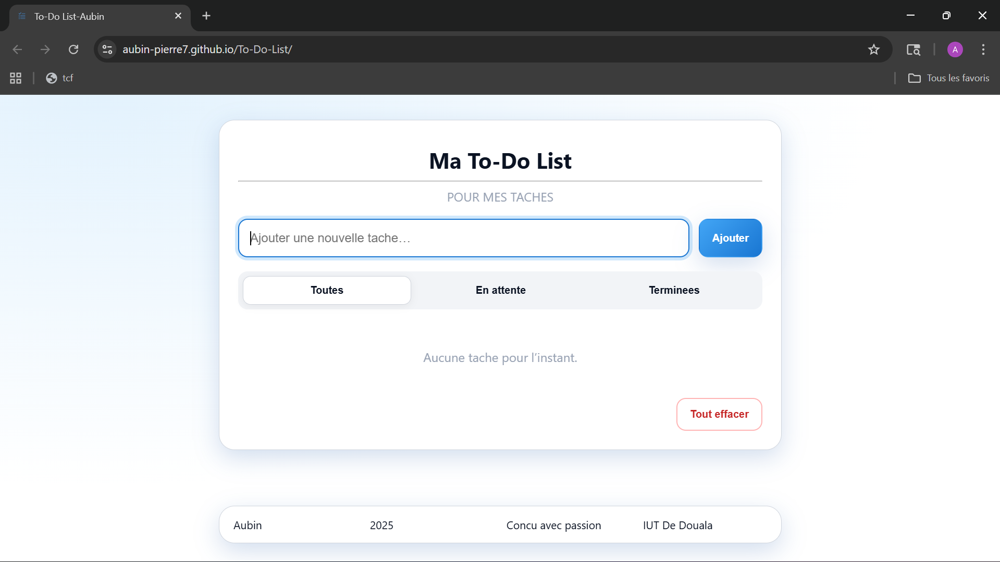
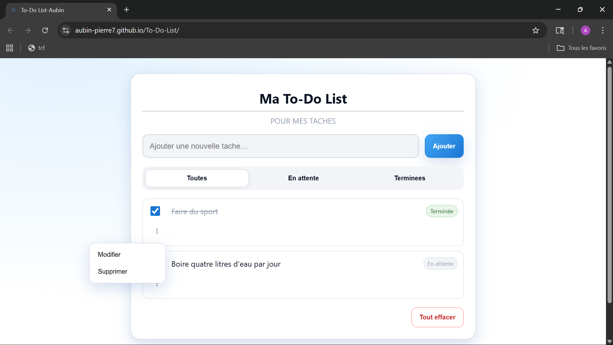

#  To-Do List

Une application *To-Do List* développee avec *HTML, CSS et JavaScript*.  
Elle permet de gerer vos taches quotidiennes de manière simple et intuitive.

##  Fonctionnalites
- Ajouter une tache  
- Marquer une tache comme terminee  
- Supprimer une tache

  ##  Captures d'écran  

|  |  |

## Démo
Lien du site en ligne: https://aubin-pierre7.github.io/To-Do-List/
